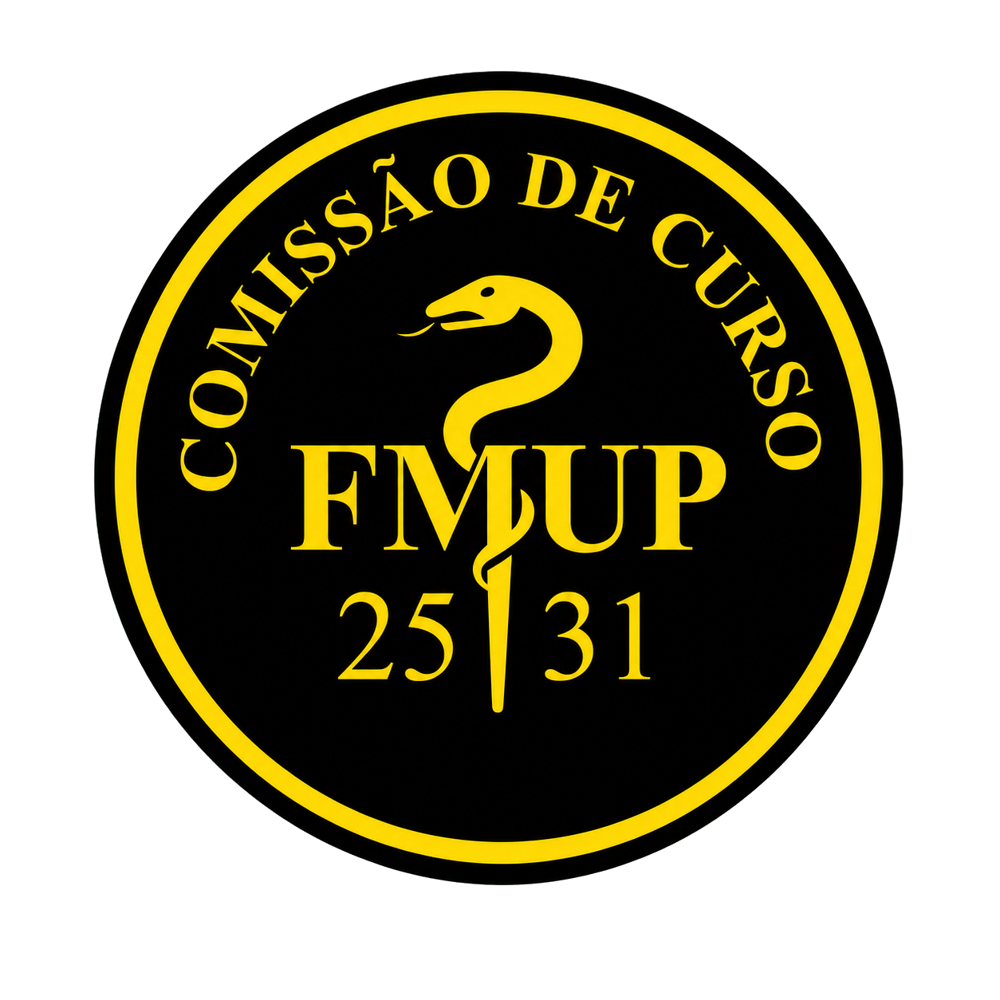

  

<h1 align="center">Gestor Universitário</h1>

  A plataforma digital da Comissão de Curso de Medicina 2025–2031 da FMUP.

  <a href="https://gestoruniversitario.cc"><strong>Aceder ao site</strong></a>

## Uma plataforma para acompanhar a vida académica

O **Gestor Universitário** reúne num único espaço a informação, os recursos e os canais de participação relevantes para os estudantes de Medicina da FMUP. A plataforma foi criada pela Comissão de Curso de Medicina 2025–2031 para substituir a dispersão por emails, formulários, ficheiros e diferentes serviços, tornando mais simples encontrar informação e acompanhar cada processo.

Cada utilizador encontra uma experiência adaptada ao seu papel. Os estudantes podem consultar conteúdos académicos, acompanhar prazos e comunicar com a Comissão. Os representantes de turma dispõem de ferramentas próprias para os processos das suas turmas. Os membros da Comissão podem publicar informação e gerir as áreas pelas quais são responsáveis. O Núcleo de Gestão e os administradores coordenam os conteúdos, os acessos e os processos globais da plataforma.

O acesso é reservado a utilizadores autorizados e a plataforma apresenta a cada pessoa apenas os conteúdos e as operações correspondentes ao seu perfil. Os módulos podem ser ativados ou desativados de acordo com as necessidades de cada fase do ano letivo.

## Dashboard pessoal

O dashboard funciona como a página inicial de cada utilizador. Reúne o que é mais importante naquele momento: próximas avaliações e entregas, eventos do calendário, avisos recentes, estado dos pedidos enviados e outras novidades relevantes. O objetivo é oferecer uma visão rápida do dia académico sem obrigar a percorrer todas as áreas do site.

## Avisos e comunicados

Esta área concentra a comunicação oficial da Comissão de Curso. Os comunicados podem ser pesquisados e filtrados, destacar informação urgente e encaminhar o estudante para conteúdos relacionados. Os membros da Comissão com as permissões adequadas podem criar e publicar avisos, ficando identificada a responsabilidade pela publicação.

## Calendário académico

O calendário reúne avaliações, entregas, eventos e outros prazos académicos numa visão cronológica. É possível filtrar os acontecimentos por unidade curricular e consultar os respetivos detalhes. A plataforma permite ainda exportar ou subscrever continuamente o calendário através de ICS, para que as atualizações possam aparecer na aplicação de calendário escolhida pelo estudante.

## Unidades curriculares

O catálogo de unidades curriculares organiza as cadeiras por ano e semestre e apresenta informação como ECTS, representantes da Comissão e conteúdos associados. Cada unidade curricular tem uma área própria que agrega os seus eventos, documentos, comunicados, materiais e ligações úteis, funcionando como ponto de entrada para tudo o que lhe diz respeito.

## Documentos e atas

A biblioteca documental disponibiliza atas, regulamentos, formulários e outros documentos úteis da Comissão de Curso. Os conteúdos podem ter diferentes níveis de visibilidade e ser atualizados ao longo do tempo, mantendo o arquivo institucional organizado e acessível.

## Materiais de estudo

A biblioteca de materiais permite consultar recursos aprovados por unidade curricular, incluindo exames anteriores, resumos, sebentas e outros conteúdos de apoio ao estudo. Os utilizadores podem enviar ficheiros ou fotografias, de forma identificada ou anónima, mas nenhum material é publicado automaticamente: todas as submissões passam primeiro por moderação.

É também possível guardar materiais nos favoritos, indicar se foram úteis, sinalizar conteúdos desatualizados e consultar versões anteriores quando um recurso é substituído por uma edição mais recente.

## Links úteis

O diretório de links reúne plataformas, serviços e recursos recomendados para o curso. As ligações podem ser pesquisadas e filtradas por categoria, prioridade e unidade curricular, permitindo encontrar rapidamente os serviços externos mais relevantes. O Núcleo de Gestão pode criar, atualizar, arquivar e organizar os links apresentados.

## Pedidos e sugestões

Este módulo cria um canal direto entre os estudantes e a Comissão de Curso. Um pedido ou sugestão pode ser enviado de forma identificada ou anónima, conforme o tema e a preferência do autor. Depois da submissão, o processo pode ser acompanhado por estados, e a resposta pode ser pública ou privada consoante a natureza do assunto.

## Inquéritos rápidos

Os inquéritos permitem recolher a opinião dos estudantes sobre temas concretos. Cada votação controla participações duplicadas e preserva o anonimato dos votos. A Comissão pode criar, editar e encerrar inquéritos, bem como decidir quando os resultados ficam disponíveis para consulta.

## Representantes e contactos

O diretório da Comissão apresenta os membros, cargos, núcleos, responsabilidades e unidades curriculares representadas. Esta área ajuda os estudantes a perceber quem acompanha cada tema e qual a pessoa ou estrutura indicada para determinado contacto.

## Gestão de turmas

O módulo de turmas apoia a composição e a distribuição dos estudantes, preservando tanto quanto possível as turmas existentes e respeitando as regras definidas para capacidades e equilíbrio. Representantes e estudantes participam apenas nas fases que lhes dizem respeito, enquanto a Comissão acompanha e valida o processo global.

A plataforma permite importar listas, validar nomes e números mecanográficos, detetar duplicados e registar estatutos especiais quando aplicável. Cada estudante pode indicar se pretende permanecer na turma atual ou submeter preferências ordenadas de mudança dentro do prazo estabelecido.

Com base nas decisões submetidas e nos critérios administrativos aprovados, o sistema calcula uma proposta global que pode combinar trocas diretas, ciclos entre várias turmas e utilização de vagas livres. Antes de qualquer publicação, a Comissão dispõe de ferramentas para pré-validar os dados, simular resultados, analisar situações que exigem revisão e efetuar correções justificadas.

As propostas são versionadas e as ações relevantes ficam registadas. Depois da aprovação, o resultado pode ser publicado e exportado, permitindo reproduzir e auditar as decisões tomadas ao longo do processo.

## Notificações

O centro de notificações reúne novidades e alertas produzidos pelas diferentes áreas do site. Cada utilizador pode distinguir itens lidos e não lidos e configurar as suas preferências de comunicação, escolhendo os tipos de conteúdo e as unidades curriculares que pretende acompanhar.

## Pesquisa global

A pesquisa global permite procurar, a partir de um único campo, informação existente em comunicados, unidades curriculares, documentos, eventos e materiais. Desta forma, o utilizador não precisa de saber antecipadamente em que módulo foi publicado o conteúdo que procura.

## Administração e histórico

A área administrativa reúne as ferramentas de gestão necessárias para manter a plataforma. Consoante as suas permissões, os responsáveis podem gerir utilizadores, módulos, unidades curriculares, comunicados, documentos, pedidos, inquéritos, materiais, links, turmas e colocações.

As operações administrativas relevantes são registadas num histórico próprio. Este registo ajuda a perceber o que foi alterado, por quem e em que momento, reforçando a transparência e a capacidade de auditoria dos processos internos.

---

  Desenvolvido para tornar a comunicação, os recursos e os processos académicos mais simples, centralizados e transparentes.

